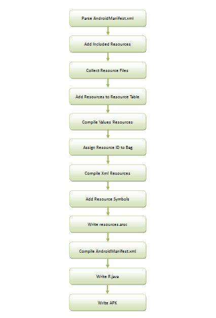

# 介绍
*本篇参考https://blog.csdn.net/luoshengyang/article/details/8744683，自己再整理，用于熟悉整理流程*
## 编译流程图
app打包过程中，会将assets，res，manifest里面的图片，xml等文件都打包，生成id到R.java，同时将资源索引表生成到resource.arsc里面。流程如图

### 处理xml
打包过程中会对xml文件从文本格式，编译成二进制格式，这是为了：
1. 二进制格式的XML文件占用空间更小。标签、属性名称、属性值和内容所涉及到的字符串都会被统一收集到一个字符串资源池中去：RES_STRING_POOL_TYPE，并且会去重
2. 二进制格式的XML文件解析速度更快。这是由于二进制格式的XML元素里面不再包含有字符串值，因此就避免了进行字符串解析，从而提高速度。
   
### 生成id
为了支持Android资源管理框架快速定位最匹配资源，Android资源打包工具aapt在编译和打包资源的过程中，会执行以下两个额外的操作
1. 赋予每一个非assets资源一个ID值，这些ID值以常量的形式定义在一个R.java文件中。
2. 生成一个resources.arsc文件，用来描述那些具有ID值的资源的配置信息，它的内容就相当于是一个资源索引表。
   
## 资源打包过程

流程：
 一. 解析AndroidManifest.xml
 二. 添加被引用资源包

 三. 收集资源文件
 四. 将收集到的资源增加到资源表
 五. 编译values类资源
 六. 给Bag资源分配ID

 七. 编译Xml资源文件
 八. 生成资源符号
 九. 生成资源索引表
 十. 编译AndroidManifest.xml文件
 十一. 生成R.java文件
 十二. 打包APK文件

 在R.java中资源id，其格式为一个8位的16进制:0xPPTTEEEE 释义:
 * PP:Package ID，包的命名空间，取值范围为[0x01, 0x7f]，一般第三方应用均为7f,我们在做插件化时为了防止宿主和插件中的资源ID重复就需要对插件中的资源的包命名空间做修改 
 * TT:资源类型，如上所示资源有attr, drawable, layout, string等资源类型，这两位代表资源的类型，这里并不是固定的，是动态生成的
 * EEEE:代表某一类资源在偏移数组中的值

bag资源指如array.xml里面的，有多个值

[参考文章]([https://blog.csdn.net/luoshengyang/article/details/8744683])

### resource.arsc结构图

[参考文章]([https://.youdao.com/](https://juejin.cn/post/6844903911602683918#heading-1))

### AndroidManifest.xml结构图

[参考文章]([[https://.youdao.com/](https://juejin.cn/post/6844903911602683918#heading-1](https://juejin.cn/post/6844903747169026061#heading-0)))